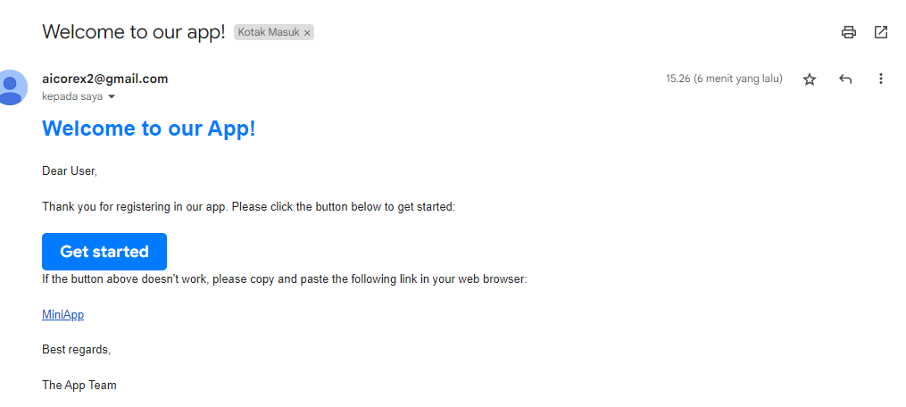
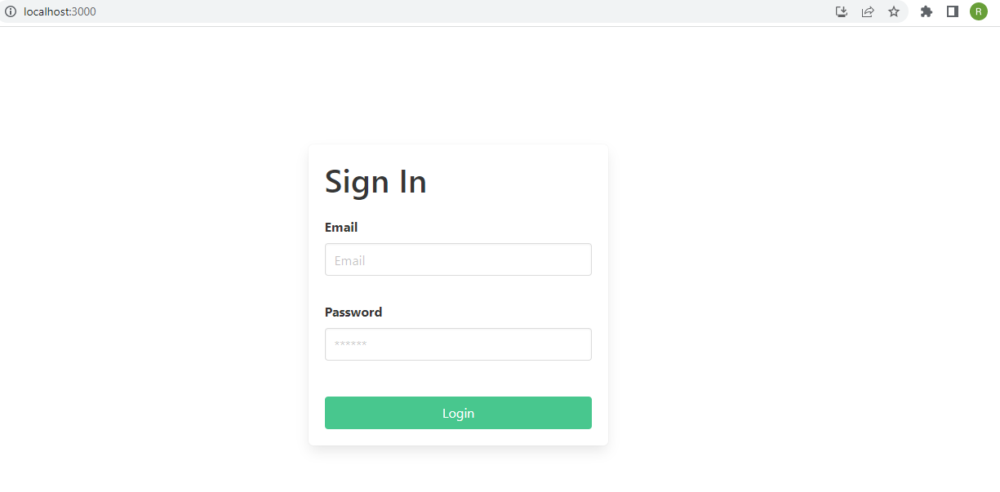

# nodemail-smtp
Testing SMTP service dengan nodemailer

Implementation :
- Button Get Started mengarah ke project miniapp (localhost:3000)
- Tamplate form dengan html
- hyperlink miniapp mengarah ke project(localhost:3000)

#### Screenshoot Output
Hasil Email yang dikirim

#### Screenshot Link
Hyerplink - miniapp

